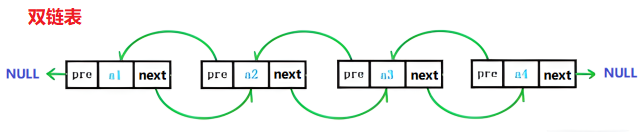

## 一、基本概念和术语

- 数据元素、数据结构、抽象数据类型等概念
- 算法设计的基本要求

**数据元素** 是数据的基本单位，在计算机程序中作为一个整体进行考虑和处理；  
一个数据元素可以有若干数据项组成，数据项是数据不可分的最小单位；
数据对象是相同性质的数据元素的集合，是数据的子集。

数据结构，是相互之间存在特定关系的数据元素的集合。包括三方面的内容：$\underline{逻辑结构、存储结构、数据的运算}$

- 逻辑结构：**线性**(线性表、栈、队列、数组、串)、**树形**（m叉树）、**图状**、集合

- 存储结构：$\begin{cases}\textbf{顺序存储}\quad 逻辑上相邻的元素存入地址连续的存储单元\\\textbf{链式存储}\quad 如二叉链表、线索二叉树\\索引存储（索引表）、散列存储（由元素key计算出存储位置）\end{cases}$ 

运算的定义是针对逻辑结构的，运算的实现是针对存储结构。不同的存储结构，运算实现方式不一样

数据类型：bool、int（原子类型）、struct（结构类型）

抽象数据类型**ADT**：定义逻辑结构和操作，不涉及存储结构

### 算法设计

$程序=数据结构+算法$ 

算法是解决特定问题的步骤的描述。算法有5个基本特性：<u>有穷性</u>，有限时间内完成，不会死循环；<u>确定性</u>，相同的输入得到唯一的输出；<u>可行性</u>；<u>输入和输出</u> 

**算法设计的要求**：正确性、可读性、健壮性（输入非法数据能做出处理）、**时间效率高和存储量低** 

算法效率的度量：时间复杂度、空间复杂度

语句频度指该语句在算法中被重复执行的次数，所有语句的频度和记为 $T(n)$ ，是关于问题规模 $n$ 的函数。

顺序执行的代码只会影响常数项，只需挑循环中的一个基本操作分析其执行次数与n的关系即可

$$
O(1)<O(\log{n})<O(n)<O(n\log n)<O(n^2)<O(n^3)<O(2^n)<O(n!)<O(n^n)
$$

## 二、线性表

- 基本概念，定义和操作
- 存储结构（实现）：顺序存储、链式存储
- 线性表的应用


$线性表是\underline{有限个}相同类型的数据元素组成的\underline{有序}序列，L=(a_1,a_2,...,a_n)$ 

操作：创建、销毁、增删改查、判空、长度

InitList(&L);DestroyList(&L);

### 顺序表

静态分配（数组），动态分配空间 $C\begin{cases}malloc\\free\end{cases}\quad Cpp\begin{cases}new\\delete\end{cases}$ 

注：malloc 函数申请一片连续的存储空间，如果要增加长度，需重新申请一片更大的空间，并释放原来的内存空间

```c
#define MaxSize 10
typedef struct {
    int data[MaxSize]; // 最大长度
    int length;  // 顺序表当前长度
}SqList;
```

指针每次取几个字节按照数据类型，a[0] p,a[1] p+4, 

### 链式存储 

特点：
- 不要求存储单元地址连续，改变容量方便
- 每个结点除了存放数据元素外，还要存储指向下一个结点的指针
- 插入和删除元素不需要移动元素，只需要修改指针，但也会导致不可随机存取

#### 单链表
链表中第一个结点的地址叫做$\underline {头指针}$。为了方便对链表操作，会在单链表的第一个结点前面加一个$\underline {头结点}$，数据域为空，指向第一个带数据的结点


```cpp
// 单链表类型定义
typedef struct LNode{
    ElemType data;
    struct LNode *next;
}LNode, *LinkList;
```

**单链表的建立**：头插法 / 尾插法。尾插法比头插法多用一个指向表尾的指针

头插法：逆序；尾插法：正序。头插法的重要应用：链表的逆置


单链表为空的条件 $\begin{cases}\text{L→next} == \text{NULL}& 带头结点\\\text{L}==\text{NULL}&不带头结点\end{cases}$

**单链表的查找、插入和删除**

```cpp
// 查找. 返回第 i 个元素的指针
LNode* getElem(LinkList L, int i){
    if(i < 1)return NULL;
    LNode* p = L->next;
    for(int j=1;j<i;j++)
        p = p->next;
    return p;
}
// 第 i 个位置插入结点
void ListInsert(LinkList &L, int i, int x){
    LNode* p = getElem(L, i-1);
    LNode * s = new LNode;
    s->data = x;
    s->next = p->next;
    p->next =s;
}

// 删除第 i 个结点
void ListDel(LinkList &L, int i){
    LNode * p = getElem(L, i-1);
    p->next = p->next->next;
}
```

三种基本操作（插入/删除/查找）的平均时间复杂度都是 O(n)

#### 双链表



#### 循环链表

循环单链表和单链表的区别：最后一个结点不指向NULL，而是指向头结点。

- 如何判空？表尾结点的next域指向头指针L，即 `L->next == L`
- 如何判断结点p是否是表尾/表头结点（前向/后向遍历的实现核心）
	- 
- 如何在插入删除一个结点
	- 基本和单链表一致，除了表尾

#### 静态链表

静态链表：分配一整片连续的内存空间，且容量固定不可变，同样不可随机存取。适用不支持指针的低级语言，数据元素固定不变的场景（如OS的文件分配表FAT）

静态链表以 `next = -1` 作为其结束的标志（指向NULL）

```c
#define MaxSize 10
typedef struct{
	int data;
	int next;
}StaticLinkList[MaxSize];
```

### 顺序表和单链表比较

|\\|顺序表|单链表|
|-|-|-|
|逻辑结构|线性表|线性表|
|存储结构|将逻辑上相邻的数据元素存放在地址连续的存储单元里|将数据元素存放在任意的存储单元里，不要求连续，通过指针连接各元素|
|空间|需要预分配存储空间, 不便扩容,且容易浪费空间|元素个数不受限制，但需要额外存储指针|
|时间性能|查找O(1)，支持随机存取;<br>插入删除O(1\*n) — 需要移动元素|查找O(n)<br/>插入删除O(n\*1)|
|场景|适合频繁查找，线性表长度大致确定的情况|适合频繁插入删除，表长未知的情况|

# 三、栈

栈“**先进后出**”

> n个不同元素进栈、出栈元素不同排列有 $\displaystyle\frac1{n+1}C_{2n}^n$ 

```c
// 基本操作
InitStack(&S);  // 初始化一个空栈
StackEmpty(S);
Push(&S, e);    Pop(&S, &e);    
GetTop(&S, &e);
```
## 顺序存储（顺序栈）

```c
// 顺序栈类型定义
#define MaxSize 10
typedef struct{
    int data[MaxSize]; 
    int top;  // 栈顶指针
} SqStack;
```

- 栈顶指针 $\text{top}=\begin{cases}-1&,栈空\\MaxSize-1&,栈满\end{cases}$ 　
- 入栈 `S.data[++S.top] = x;` 
- 出栈 `return S.data[S.top--];` 

---

顺序栈必须预分配数组空间，为了充分利用存储空间，产生了<u>共享栈</u>。两个栈的栈顶指针往中间增长，栈空条件 `top1=-1,top2=MaxSize` ；栈满条件 `top1 +1 == top2` 

```c
// 共享栈类型定义
typedef struct{
    int data[MaxSize]; 
    int top1, top2; 
} SqDoubleStack;
```


## 链式存储（链栈）

```c
// 链栈类型定义
typedef struct LinkNode{
    int data;
    LinkNode * next;
}* LinkStack;
```

栈的元素顺序和链表的头插法一致，是逆序的，因此出栈和入栈都在链表的表头进行，<u>头插 / 头删</u> 

基本操作：创建、查

**链栈不需要头结点，头指针指向栈顶元素**，且链栈不存在栈满的情况。

```c
bool StackEmpty(LinkStack S){ // 判空
	return (S==NULL)?true:false;
}
void Push(LinkStack &S, int x){ // 增
    LinkNode * p = new LinkNode;
    p->data = x;
    p->next = S;
    S = p;
}
void Pop(LinkStack &S){ // 删
    LinkNode * p = S;
    S = S -> next;
    free(p);
}
```


## 栈的应用

1、**括号匹配**

最后出现的左括号最先被匹配，扫描到右括号就让左括号出栈

```c
bool bracketCheck(char str[], int length){
    SqStack S;
    InitStack(S);
    for(int i=0;i<length;i++){
        if(str[i]=='{' || str[i]=='(' || str[i]=='[')
            Push(S, str[i]);
        else{
            if(StackEmpty(S))return false;
            char topElem;
            Pop(S, topElem);
            if(str[i]==')' && topElem != '(')return false;
            if(str[i]==']' && topElem != '[')return false;
            if(str[i]=='}' && topElem != '{')return false;
        }
    }
    return StackEmpty(S);
}
#define MaxSize 10
typedef struct{
    char data[MaxSize];
    int top;
}SqStack;
自己写一遍试试
```


2、**表达式求值**

按运算符在两操作数的位置，分为 $\begin{cases}中缀表达式&a+b-c*d\\后缀表达式&ab+cd*-\\前缀表达式&-+ab*cd\end{cases}$

中缀转后缀 "左优先"、中缀转前缀"右优先"，保证算法的确定性

后缀表达式求值、前缀表达式求值

原则操作数先入栈，根据具体表达式确定顺序扫描还是逆序扫描，遇到运算符，弹出两个栈顶元素，运算结果再入栈


3、**递归**

每一层递归调用，将 **返回地址、参数值和局部变量**，压入栈中。在退回阶段，再将位于栈顶的局部变量、参数值和返回地址弹出。

递归层数过多可能栈溢出，递归的效率较低，优点是代码简单

# 四、队列 

队列 “**先进先出**”

队列有两个指针，front 指向队首元素，rear 指向队尾元素的下一个位置

```c
// 基本操作
InitQueue(Queue &Q)
QueueEmpty(Q)
EnQueue(&Q, &e)
DeQueue(&Q, e)
```
## 顺序存储

**循环队列** 类型定义
```c
#define MaxSize 6
typedef struct{
    int data[MaxSize];
    int front, rear;
}SqQueue;
```


✨ 队列长度：`(Q.rear - Q.front + MaxSize) % MaxSize` 

队首 / 队尾指针进 1：$\begin{aligned}&Q.front = (Q.front+1)\ \%\ \text{MaxSize}\\&Q.rear\ \ =(Q.rear\ \ +1)\ \%\ \text{MaxSize} \end{aligned}$

```c
void EnQueue(SeqQueue &Q, int x){
    if((Q.rear+1)%MaxSize == Q.front)
        printf("队满, 无法入队\n");

    Q.data[Q.rear] = x;
    Q.rear = (Q.rear + 1) % MaxSize;
}
void DeQueue(SeqQueue &Q){
    if (Q.rear == Q.front)
        printf("队空, 无法出队\n");

    Q.front = (Q.front+1) % MaxSize;
}
```

判断队满的三种方式
1. 放弃一个存储单元，rear指向front前面一个位置时，已满`(Q.rear+1) % MaxSize == Q.front`
2. 在队列中添加元素size，记录元素个数，当 `size == MaxSize` 队满；当 `size == 0` 队空
3. 增加元素tag=0/1，标记最后一次操作是出队/入队；队满 `front == rear && tag == 1` ，队空`front == rear && tag == 0` 

## 链式存储

 ```c
 // 链队列 类型定义
 struct LinkNode{ //队列中的结点
     int data;
     LinkNode *next;
 };
 struct LinkQueue{
     LinkNode *front, *rear;
 };
 ```

不同于栈，链队列通常使用<u>带头结点</u>的单链表


```c
bool EnQueue(LinkQueue &Q, int x){
    QNode* p = (QNode *)malloc(sizeof(QNode));
    if (!p) return false; // 内存分配失败
    p -> data =x;
    p -> next = NULL;
    Q.rear ->next = p;
    Q.rear = p;
    return true;
}
int DeQueue(LinkQueue &Q){
    QNode *p = Q.front;
    Q.front = Q.front ->next;
    free(p);
    return 0;
}
```

**双端队列**，两端都可以插入和删除

## 队列的应用

在层次遍历中：根节点入队，队首的左右孩子入队，队首出队

计算机系统中：解决主机与外设之间速度不匹配问题；多用户引起的资源竞争问题。如打印机设置数据**缓冲区**，先进先出的原则取数据打印，打印完再向主机发出请求

# 数组和特殊矩阵

一般地，矩阵下标从 1 开始，数组下标从0开始
## 特殊矩阵的压缩存储

特殊矩阵：如对称矩阵、上下三角矩阵、对角阵、稀疏矩阵等

压缩存储，指多个值相同的元素共用一个存储空间，对0元素不分配空间，以节省存储空间。

- 普通存储 n * n 二维数组

- 对称阵：只存储主对角线 + 上/下三角区，行优先将各元素存入一维数组。实现一个映射函数，矩阵下标—>一维数组下标

- 三角矩阵，相比于对称阵，在一维数组最后加上常量C

- 三对角矩阵（带状）3n-2个元素

- **稀疏矩阵**，元素很多都是 0 的矩阵
	- 三元组<行，列，值>
	- 十字链表法

# 串

串的逻辑结构和线性表极为相似，区别仅在于串的数据对象限定为字符集

**串的下标从 1 开始**，如 `'ABC' 在主串"aABCabcd"中的位置为 2` 