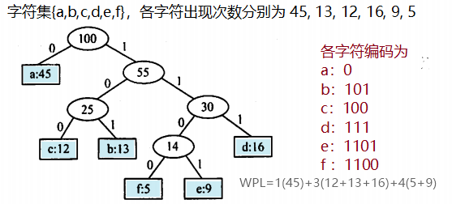
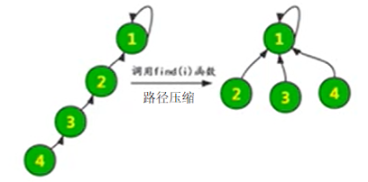

# 树

基本概念：
- ❗ 结点的<u>子树个数</u>称为结点的**度**，而树中结点的度的最大值称为树的**度**
	- 度大于0的结点称为分支结点，度为0的称为叶结点（终端结点）
	- 📌 结点数 $n$，边数 / 所有结点的度数和 $n-1$ 

- 结点的层次：根结点为第 1 层，它的子节点为第 2 层，以此类推
	- 树的高度（深度）是树中结点的最大层数

- 路径：树中的路径是自上而下的，两个结点之间的路径由两个结点之间所经过的结点序列构成，<u>路径长度</u>就是经过的边的个数

- 高度为h的m叉树，最多有$\displaystyle\frac{m^h-1}{m-1}$ 个结点

## 二叉树

二叉树的子树左右有序，每个结点至多有两个子树，即度数不超过2的有序树


完全二叉树性质

- $i$ 结点的父结点 $i/2$ ，左孩子 $2i$，右孩子 $2i+1$ 

- 若 $\displaystyle i\le n/2$ ，则 $i$ 是分支结点，否则是叶子结点

- 叶结点数等于度数为2的结点数加1，$n_0=n_2+1$ 

- 高度为 h 的二叉树至多有 $2^{h}-1$ 个结点。推论：有n个结点的完全二叉树的高度，$2^h-1\ge n\quad\Rightarrow\quad h=\lfloor \log_2{n}\rfloor+1$ 

### 存储结构

#### 顺序存储


按照完全二叉树中的结点编号，将结点和数组下标进行对应，从而顺序存储
#### 链式存储（二叉链表）


> 含有 n 个结点的二叉链表中，有 $n+1$ 个空指针域 

### 二叉树的遍历


**层次遍历**（从上到下，从左到右逐个访问），需要借助一个队列，首先是根结点入队，此后每次出队一个结点元素，并将该结点的左右孩子入队

```c
void levelOrder(BiTree T){
	initQueue(Q);
    BiTree p;
    EnQueue(Q, T);
    while(!isEmpty(Q)){ //队列非空 Q.rear != Q.front
        DeQueue(Q, p); 
        visit(p);
        if (p->lchild!=NULL) // 左孩子非空则入队
            EnQueue(Q, p->lchild);
        if (p->rchild!=NULL) // 右孩子非空则入队
            EnQueue(Q, p->rchild);
    }
}
```
### 线索二叉树

二叉树的**线索化**，指将二叉链表的空指针改为指向前驱或后继的线索（n个结点的二叉树，有 n+1个空链域可用）

还需引入两个标志变量 `ltag` 和 `rtag` ，为0时表示指针指向孩子结点，为1时表示指针指向前驱或后继

作用：方便从一个指定结点出发，找到其前驱、后继；方便遍历

```c
// 线索二叉树 类型定义
typedef struct ThreadNode{
    int data;
    ThreadNode *lchild, *rchild;
    int ltag, rtag; //线索标记, 0表示孩子, 1表示线索
}ThreadNode, *ThreadTree;
```


二叉树的线索化
```c
// 中序线索化
ThreadNode *pre = NULL; //指向当前访问结点的前驱
void InThread(ThreadTree p){
	if(p){
		InThread(p->lchild, pre);  // 递归, 线索化左子树
		if(p->lchild == NULL){     // 左子树为空, 建立前驱线索
			p->lchild = pre;
			p->ltag = 1;
		}
		if (pre!=NULL && pre->rchild == NULL){
			pre->rchild = p;
			pre->rtag = 1;
		}
		pre=p;
		InThread(p->rchild, pre);
	}
}
// 中序线索化二叉树
void CreateThread(ThreadTree T){
	ThreadTree pre = NULL;
	if(T){
		InThread(T, pre);
		pre -> rchild = NULL; // 处理遍历的最后一个结点
		pre -> rtag =1;
	}
}
```


## 树和森林

### 树的存储结构

1、双亲表示法：data、parent，根结点parent设为-1，其他的设置为父节点下标；


2、孩子表示法：data、\*firstChild  

将每个结点的孩子结点都用单链表链接起来形成一个线性结构，n个结点就有n个孩子链表（叶子结点的孩子链表为空表）


3、孩子兄弟表示法（**二叉树表示法**）

优点是可以将树转换为二叉树


### 森林与二叉树的转换

**树转二叉树、森林转二叉树**　每个结点的$\begin{cases}右指针指向下一个兄弟结点，\\左指针指向第一个孩子结点\end{cases}$


**二叉树转树** 

**二叉树转森林**：对根结点的右子树递归断开右链


### 树和森林的遍历

**树的遍历**

- 先根遍历（根左右），遍历序列同该树对应的二叉树的<u>先</u>序序列
- 后根遍历（左右根），遍历序列同该树对应的二叉树的<u>中</u>序序列
- 层序遍历，上到下，左到右。即树的广度优先遍历，通过队列实现

**森林的遍历**

- 先序遍历 $\leftrightarrow$ 各个树依次先根遍历 $\leftrightarrow$ 森林转为二叉树，再作先序遍历
- 中序遍历 $\leftrightarrow$ 各个树依次后根遍历 $\leftrightarrow$ 森林转为二叉树，再作中序遍历

### 树的应用

#### Huffman

**哈夫曼树** 

结点的带权路径长度：根到该结点的路径长度 × 该结点的权值

树的带权路径长度：所有叶结点的带权路径长度和 $WPL=\sum{w_il_i}$ 

在含有 $n$ 个**带权叶结点**的二叉树中，带权路径长度（WPL）最小的二叉树称为**哈夫曼树**，即最优二叉树

规则：每次选择两个权值最小的结点作为左右结点，权值和作为父节点，循环操作


**哈夫曼编码**

字符集中的每个字符作为叶子结点，字符出现的次数即权值W，构造对应的Huffman树

若没有一个编码是另一个编码的前缀，则称这样的编码为前缀编码




#### 并查集
Union-find Sets，主要用于处理一些不相交集合的合并问题，如森林。常见的用途有：求连通子图，最小生成树的Kruskal算法

使用双亲数组表示法来表示并查集

```c
#define Size 10
int fa[Size]; // 存放第 i 个元素的父节点
int find(int fa[], int x); // 查找元素x 的根节点
void Union(S, int i, int j);

void initial(int fa[]){
    for(int i=0; i<Size; i++) fa[i] = i; // 父节点设为自身
}
int find(int fa[], int x){
    if(fa[x] == x)return x;
	else return find(fa[x]);
}
void Union(int fa[], int i, int j){
	int iRoot = find(fa, i);
	int jRoot = find(fa, j); 
	fa[iRoot] = jRoot;  // i的根结点指向j的根结点
}
```

优化 `union` **小树合并到大树**，不增大树高，令$S[Root] = 树的结点数$ 

```c
void Union(int S[], int Root1, int Root2){
    if(Root1 == Root2) return;
    if(S[Root2] > S[Root1]){
        S[Root1] += S[Root2];
        S[Root2] = Root1;
    }else{
        S[Root2] += S[Root1];
        S[Root1] = Root2;
    }
}
```

优化 `find` **压缩路径**，从某点出发向上查找根结点，将查找路径上的所有的结点直接挂到根结点上，即父节点数组 `S[i]=root`   



```c
int find(int fa[], int x){
    if(fa[x] == x)return x;
    else {
	    fa[x]=find(fa[x]); // +add
	    return find(fa[x]);
	}
}

最坏时间复杂度
Find	O(n)	O(logn)		O(α(n))
Union	O(n^2)	O(nlogn)	O(nα(n))
```

https://www.cs.usfca.edu/~galles/visualization/DisjointSets.html

# 图

图 $G$ 由非空顶点集 $V$ 和边集 $E$ 组成，记为 $G(V,E)$ 

$\begin{aligned}&V=\{v_1,v_2,...,v_n\}&|V|表示顶点数\\&E=\{\ (u,v)\ 或\ \langle u, v\rangle\ |\ u,v\in V\}&|E|表示边数\end{aligned}$ 

顶点的度：$\begin{cases}全部顶点的度数和 = 2 倍边数&,无向图\\出度和 = 入度和 = 边数&,有向图\end{cases}$ 

简单图：①无重复边；②不存在顶点到自身的边，数据结构只讨论简单图

完全图：任意两个顶点之间都有边

$\begin{cases}连通图&,任意两个顶点连通的无向图\\强连通图&,任两顶点双向连通的有向图\end{cases}$  


连通图的**生成树**：包含全部顶点的一个极小连通子图（边数最少）  
非连通图的生成森林

带权图（网）：边上有权值的图，权值可以表示两点间的距离

边少的叫稀疏图，适合邻接表存储

## 图的存储结构
### 邻接矩阵


存储顶点之间邻接关系的二维数组$A$ 称为**邻接矩阵** 。$V=\{v_1,v_2,...,v_n\}$ 

无权图：$A[i][j]=\begin{cases}1,&(v_i,v_j)\in E\ 或\ \langle v_i,v_j\rangle\in E\\0,&(v_i,v_j)\notin E\ 或\ \langle v_i,v_j\rangle\notin E\end{cases}$ 

带权图：$A[i][j]=\begin{cases}w_{ij},&(v_i,v_j)\in E\ 或\ \langle v_i,v_j\rangle\in E\\0,&(v_i,v_j)\notin E\\\infty,&\langle v_i,v_j\rangle\notin E\end{cases}$ 

```c
#define N 8
struct MGraph{
    char vertex[N]; // 顶点表
    int edge[N][N]; // 边表
    int vexnum, arcnum; // 顶点数和边数
};
```

邻接矩阵特点：
1. 无向图的邻接矩阵是对称矩阵且唯一，可以压缩存储；

2. <u>无向图</u>中，顶点 $i$ 的度 = 矩阵第 $i$ 行值为1 或 $w_{ij}$ 的元素个数；
   <u>有向图</u>中，顶点 $i\begin{cases}出度 = 矩阵第 i 行\\入度 = 矩阵第 i 列\end{cases}$ 值为1 或 $w_{ij}$ 的元素个数； 

3. 用邻接矩阵存储图，容易确定两点之间是否有边相连，但是有多少边，就需要遍历二维矩阵了，时间代价大

4. 边多的叫稠密图，适合邻接矩阵存储，充分利用存储空间


### 邻接表法


邻接表，是对图G中每个顶点$v_i$ 建立一个单链表，每个单链表中的其余结点表示依附于顶点$v_i$的边。

- 有向图的空间复杂度 $O(|V|+|E|)$ ，无向图 $O(|V|+2|E|)$ 
- 图的邻接表表示<u>不唯一</u>，因为在各个顶点的单链表中，各边结点的次序是任意的
- 邻接表中，给定顶点，很容易找到所有邻边；
- 有向图的邻接表，入度的计算需要遍历整个邻接表，效率较低；

```c
// 邻接表表示
struct ArcNode{ //边表结点
    int a;
    ArcNode * next;
};
typedef struct VNode{ // 顶点表结点
    char vertex;
    ArcNode * first;
}VNode, AdjList[N];

struct ALGraph{ // 邻接表
    AdjList vertices; // 即 VNode[N] vertices;
    int vexnum, arcnum;
};
```
## 图的遍历

为避免同一结点被多次访问，可以设一个辅助数组 `visited[]` 标记顶点是否被访问过

邻接表法表示的图不唯一，故深搜和广搜的序列不唯一，生成树也不唯一；但邻接矩阵表示唯一，搜索序列也唯一

**广搜与深搜的比较**

- 空间复杂度：BFS需要一个辅助队列，$O(|V|)$；DFS最坏情况递归深度为 $O(|V|)$ 
- 时间复杂度（访问所有的结点和边的时间）：邻接矩阵$O(|V|^2)$ 邻接表 $O(|V|+|E|)$ 

- 图的遍历与图的连通性：
	- 遍历连通图，调用一次 `BFS()` 或 `DFS()` 函数即可访问全部顶点。而遍历非连通图，需要分别遍历每个连通分量
	- 若是对有向图进行遍历，调用 BFS/DFS 函数的次数要具体问题具体分析。若起始顶点到其他各顶点都有路径，则只需调用1次BFS/DFS函数

### 深度优先搜索DFS

> 类似于树的深度优先（先根遍历）


深度优先序列（根据存储结构看）


- 从1出发的深度优先遍历序列：1,2,6,3,4,7,8,5
- 从2出发的深度优先遍历序列：2,1,5,6,3,4,7,8
- 从3出发的深度优先遍历序列：3,4,7,6,2,1,5,8

```c
bool visited[Max_Vertex_Num];
void DFSTraverse(Graph G){
    for (v = 0; v < G.vexnum; v++) 
        visited[v]=false;
    for (v=0; v<G.vexnum; v++)
        if(!visited[v])
            DFS(G, v);
}
void DFS(Graph G, int v){
    visit(v);
    visited[v]=true;
    for(w=FirstNeighbor(G,v);w>=0;w=NextNeighbor(G,v,w))
        if(!visited[w])
            DFS(G,w);
}
```


### **广度优先搜索BFS**

> 类似于树的层序遍历（广度优先遍历）：1.若树非空，根节点入队；2.若队列非空，队头元素出队并访问，同时将该结点的孩子依次入队；3.重复2直到队列为空

原理：都是通过某一结点找到与之相邻的其他结点

1. 找到与一个顶点相邻的所有顶点
2. 标记哪些顶点被访问过
3. 需要一个辅助队列

- 从顶点 $v_i$ 出发的广度优先遍历序列，即依次输出到 $v_i$ 的路径长度为 $1,2,..,h$ 的结点

- 广度优先生成树：广度优先遍历过程中路径上所有的边和点，其余边删除 

```c
bool visited[Max_Vertex_Num];
void BFSTraverse(Graph G){
    for (v = 0; v < G.vexnum; v++) 
        visited[v]=false;
    InitQueue(Q);
    for (v=0; v<G.vexnum; v++)
        if(!visited[v])
            BFS(G, v);
}

void BFS(Graph G, int v){
    visit(v);
    visited[v]=true;
    enQueue(Q, v);
    while(isEmpty(Q) == false){
        v = delQueue(Q);
        for(int w=FirstNeighbor(G, v); w>0; w=NextNeighbor(G,v,w))
            if(!visited[w-1]){
                visit(w);
                visited[w]=true;
                enQueue(Q, w);
            }
    }
}
```


## 图的基本应用

### 最小生成树MST

$\begin{cases}Prime\ 算法\\Kruskal\ 算法\end{cases}$ 

生成树：包含全部 $n$ 个顶点的一个极小连通子图（边数最少，即 $n-1$条边）

对于**带权**连通无向图G，各边权值和最小的生成树，称为G的最小生成树

- Prim 算法：从一**顶点**出发，每次选取一个到"已访问顶点集合"距离最短的顶点加入集合

时间复杂度 $O(|V|^2)$，适合边稠密图

- Kruskal 算法：每次选择一条权值最小的**边**，但如果这条边两端的顶点已经连通就不选这条边）

时间复杂度 $O(|E|\log_2|E|)$ ，适合边稀疏图


### 最短路径

1、**Dijkstra算法**（贪心策略）：从一点出发到其他各顶点的最短路径（单源最短路径）

每次选取一个到**源点**路径最短的结点加入，而不是prim的已访问集合


时间复杂度 $O(|V|^2)$ 

2、**Floyd算法**（动态规划）：求出每一对顶点之间的最短路径

```c
for (int k=0;k<n;k++){ // 以顶点Vk为中转点
	for(int i=0; i<n; i++) // 遍历整个矩阵
		for(int j=0; j<n; j++)
			if(A[i][j]>A[i][k]+A[k][i]){
				A[i][j] = A[i][k]+A[k][i];
				path[i][j]=k;
			}
}
```

时间复杂度 $O(|V|^3)$ ，空间复杂度$O(|V|^2)$ 


📌Tips: 
- 以第 i 个顶点 $V_{i-1}$ 作中转点，则数组的第 i 行和第 i 列，保持不变
- 主对角线上的点是自身到自身，恒 0


### 拓扑排序

AOV网（<u>顶点</u>表示活动的网）：用DAG图（有向无环图）表示一个工程，顶点表示活动，有向边$<V_i,V_j>$表示活动 $V_i$ 先于$V_j$进行

**拓扑排序**的实现：

① 从AOV网中选择一个没有前驱（**入度**为0）的顶点输出

② 从网中删除该顶点和所有以它为起点的有向边

③ 重复①和②，直到AOV网为空

**逆拓扑排序**：每次选择一个没有后继（**出度**为0）的顶点输出


### 关键路径

在带权有向图中，以顶点表示事件$V_k$，有向边表示活动$a_j$，边上的权值表示完成活动的开销（如需要的时间），称为AOE网（用<u>边</u>表示活动的网络）

从源点到汇点，具有最大路径长度的路径称为关键路径，关键路径上的活动是关键活动

$事件V_k\begin{cases}最早发生时间&ve(k)\\最迟发生时间&vl(k)\end{cases}$

$活动a_i\begin{cases}最早开始时间&e(i)\\最迟开始时间&l(i)\\时间余量&d(i)=l(i)-e(i)\end{cases}$

找出所有时间余量 $d(i)=0$ 的活动构成**关键路径**


关键路径唯一时，缩短关键活动的时间可以缩短工期，但缩小到一定程度，关键活动可能变成非关键活动

关键路径不唯一时，只缩短一条关键路径上关键活动时间，不能缩短工期，除了所有关键路径都要进行的活动

