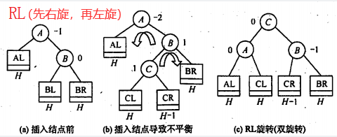
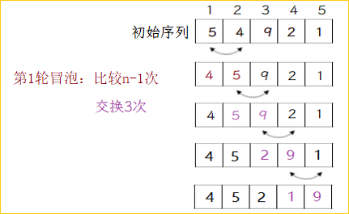
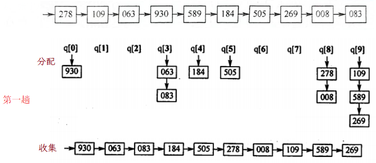

# 查找

基本概念
- 查找：在查找表中确定一个关键字等于给定值的数据元素（或记录）
	- 关键字：唯一标识数据元素的某个数据项的值
- 查找表：由同一类型的数据元素组成的数据集合，用于查找
	- 静态查找表，只查；动态查找表，查找的同时插入或删除

查找算法效率的评价指标：**平均查找长度ASL** 

$ASL=\sum {P_iC_i}$　，$\begin{aligned}&C_i\ : 元素\ i\ 的查找长度,\ 比较关键字的次数\\&P_i\ : 查找元素\ i\ 的概率,一般认为等概率,\ 即\frac1n\end{aligned}$ 

## 静态查找表
对于静态查找表，可以用线性表结构组织数据，使用顺序查找算法

### 顺序查找

一般顺序表的线性查找

```c
int SeqSearch(int A[], int n, int key){
    for (int i=0; i<n; i++){
        if (A[i] == key) return i;
    }return -1;
}
// 使用哨兵的写法
int SeqSearch(int B[], int n, int key){
    B[0] = key; // 数组扩展一个容量, 哨兵存放在查找方向的尽头 
    for(int i=n; B[i]!=B[n]; i--); //不用判断数组越界
    return i;// i=0遇到本身,查找失败
}
```

查找效率分析：$ASL=\sum{P_iC_i}=\displaystyle\frac{1}{n}\sum_{i=1}^{n} i=\frac{n+1}2$ 

有序表的顺序查找判定树，树高为n


$\displaystyle ASL_{失败}=\sum{P_iC_i}=\frac{1+2+...+n+n}{n+1}=\frac{n}{2}+\frac{n}{n+1}$  


### 折半查找（二分查找）

```c
int binarySearch(int arr[], int low, int high, int e){
    while(low<=high){
        int mid = (low+high)/2;
        if(arr[mid] == e) return mid;
        else if (arr[mid]<e)
            low= mid+1;
        else
            high = mid-1;
    }return -1;
}
```

描述折半查找过程的判定树，是一棵**平衡二叉树**

有序表 (3, 4, 5, 7, 24, 30, 42, 54, 63, 72, 87, 95) 

- **仅适用于有序的顺序表**，顺序表拥有随机访问的特性，链表没有
- 二分查找给定值的比较次数不会超过树高，因而时间复杂度 $O(\log_{2} n)$  

### 分块查找

又称索引顺序查找。对查找表分块，第 $i$ 块中的元素全部小于第 $i+1$ 块的元素.

建立索引表，存储每个子块中的最大值和首元素的地址，索引表有序排列。

先查索引表$I$，确定在哪一个子块中，再顺序查找子块$S$。平均查找长度为 $L_I+L_S$ 

> 最理想的子块长度为 $\sqrt n$ 

## 动态查找表

动态查找，使用二叉排序树的查找技术

### 二叉排序树BST

二叉排序树，又称二叉查找树 **BST** 

**左子树 < 根节点 < 右子树** $\Rightarrow$ 中序遍历可以得到一个递增序列

```c
typedef struct TNode{
    int key;
    TNode *lchild, *rchild;
}TNode, *BSTree;
// 在二叉排序树中查找值为 key 的结点
TNode * BST_Search(BSTTree T, int key){
    while(T){
        if(T->data == key) break;
        if(T->data > key) T=T->lchild;
        else T=T->rchild;
    }return T;
}
// 递归查找
BSTNode *BSTSearch(BSTree T,int key){
	if(T==NULL)return NULL; //查找失败
	if(key==T->key)return T; //查找成功
	else if(key < T->key)
        return BSTSearch(T->lchild, key); //在左子树中找
    else
        return BSTSearch(T->rchild, key);//在右子树中找
}   
```

**二叉排序树结点的删除**，在该结点的左子树找一个最大的结点代替，或者右子树找一个最小的替换


### 平衡二叉树AVL

为了避免树的高度增长过快，降低<u>二叉排序树</u>的性能，规定任何结点的左右子树高度差 ≤ 1，这样的树称为**平衡二叉树**，或称AVL树。 

$平衡因子=左子树高度-右子树高度$，故平衡树的结点平衡因子只能是 -1，0或1

平衡二叉树在插入、删除结点时，会通过旋转 *最小不平衡子树* 保持平衡

**平衡二叉树的插入操作**

LL：在A结点的$\underline{左}$孩子的$\underline{左}$子树中插入结点导致的不平衡


 

**平衡二叉树的删除操作** ：和插入类似，观察删除结点后，导致树不平衡的结点的位置，作LL、RR、LR 或 RL 旋转


**查找效率分析**：含有 n 个结点的平衡二叉树的高度为 $O(\log_{2}n)$，查找一个关键字最多对比h次，因此平衡二叉树的平均查找长度为 $O(\log_{2}n)$ 

**假设以$n_h$表示深度$h$ 的平衡树最少结点数**，则 $\begin{aligned}&n_1=1\\&n_2=2\\&n_h=n_{h-1}+n_{h-2}+1\end{aligned}$ 


### B-树

B-树是一种**平衡**的多路**查找树**，主要用作文件系统的索引

m阶 B树，满足条件：
- 结点（除了根和叶子）的子树棵数 $\lceil m/2\rceil\sim m$ ；关键字取值范围：$\lceil m/2\rceil-1\sim {m-1}$ 
- 所有叶节点在同一层上（即查找失败结点，实际不存在，不包含信息，指向这些结点的指针为空）


> 含 n 个关键字的m阶B树，高度$h\ge \log_m(n+1)$ 

**B-树的插入** ，关键字个数不能超过 m-1，否则会导致结点的“分裂”


对于非终端结点，删除关键字，可以直接用当前关键字的左指针最后一个元素替换掉该关键字，或者右指针最先一个元素替换


---

B+树，是应文件系统所需而产生的 B树的变形，更加适用于操作系统的文件索引和数据库索引。

特点：一个关键字对应一棵子树，；所有的叶结点包含全部的关键字及指向相应记录的指针，叶结点按关键字大小排序，相互链接起来


> B 和 B+树都支持随机查找

### 红黑树

## 散列表

**Hash Table**，可以根据数据元素的关键字，通过哈希函数计算出它在散列表中的存储地址，$Addr=Hash(key)$ 

“冲突(碰撞)”：不同的 key 映射到同一个内存地址

评判一个散列函数优劣的两个主要条件：$\underline{出现冲突的概率}$ 和 $\underline{遇到冲突后的处理方法}$

即构造更合适的散列函数以减少冲突的发生，当冲突已然发生，处理方法有 **链地址法**；**开放定址法** 

### 散列函数的构造

- 除留余数法：取小于等于m的最大质数 p（对质数取余，分布更均匀）
    - 例如散列表表长m=15，可令散列函数 `H(key)=key%13` 
- 直接定址：线性函数，一对一，如 $H(key) = a×key +b$，适合关键字基本连续的情况，否则空位较多造成存储空间浪费
- 数字分析法：选取数码分布较为均匀的若干位作为散列地址，直接取手机号的后四位作存储地址
- 平均取中法：取关键字的平方值的中间几位作为散列地址

### 冲突的处理方法

1、**链地址法** ：把所有“同义词”存储在一个链表


2、**开放定址法**，就给冲突的新元素找另一个空闲位置

原理：需确定一个“探测序列”，从初始散列地址出发，去寻找下一个空闲位置。发生第 $i$ 次冲突时的散列地址为 $H_i=(H(key)+d_i)\ \%\ m,\ 散列表长度m, 偏移量d_i$ 

$$
构造探测序列d_i
\begin{cases}
线性探测法&:d_i=0,1,2,..,m-1\\
平方(二次)探测法&: d_i=0, 1^2, -1^2,..,k^2,-k^2\\
伪随机序列法&: d_i=0,5,3,11...

\end{cases}
$$

3、再哈希法，$H_i=RH_i(key)$ ，每当同义词产生冲突，计算另一个哈希函数地址，直到冲突不再发生，但增加了计算的时间


直接删除元素会导致出现空位置，导致后面的元素查找失败

可以添加标志位flag，逻辑删除，不能简单将元素空间置空

删除元素，会导致散列表变稀疏，从而查找效率下降，可以不定期整理散列表中的数据，如果可能，让发生冲突的元素回到本来的位置；或者新元素插入到逻辑删除的结点


# 内部排序

内部排序，数据都在内存中；外部排序，数据太多，无法全部放入内存

内部排序算法主要进行两种操作：$\underline{比较}$和$\underline{移动}$ 

排序的稳定性：相同的key，在排序前后相对位置不变，则称排序算法是稳定的；算法的稳定性与算法优劣无关

对任意n个关键字排序的比较次数至少为 $\lceil\log_2(n!)\rceil$ 

|              | 时间复杂度                                     | 空间复杂度   | 稳定性 |
| ------------ | ---------------------------------------------- | ------------ | ------ |
| 直接插入排序 | $O(n)\quad O(n^2)\quad O(n^2)$                 | $O(1)$       | ✓      |
| 冒泡排序     | $O(n)\quad O(n^2)\quad O(n^2)$                 | $O(1)$       | ✓      |
| 简单选择排序 | $O(n^2)$                                       | $O(1)$       | ×      |
| 希尔排序     | 优于$O(n^2)$                                   | $O(1)$       | ×      |
| 快排         | $O(n\log_2{n})\quad O(n\log_2{n})\quad O(n^2)$ | $O(\log_2n)$ | ×      |
| 堆排序       | $O(n\log_2{n})$                                | $O(1)$       | ×      |
| 2 路归并排序 | $O(n\log_2{n})$                                | $O(n)$       | ✓      |
| 基数排序     | $O(d(n+r))$                                    | $O(r)$       | ✓      |

- 基本有序，直接插入或冒泡排序为宜
- 若n较小，可采用直接插入或简单选择排序
- **辅助空间**：堆排序 < 快排 < 归并排序
- 希尔排序和堆排序利用了顺序存储的随机访问特性，不适合链式存储
- 基数排序不需要比较
- 交换类的排序（冒泡和快排），其趟数和原始序列状态有关

## 插入排序

每次将一个待排序的记录按照key大小插入到前面已排序的子序列中

1、直接插入排序：顺序查找到要插入的位置

2、折半插入排序，仅适用顺序表，不适用于链表

注意:一直到low>high时才停止折半查找。当mid所指元素等于当前元素时,应继续令 low=mid+1，以保证“稳定性”。最终应将当前元素插入到low所指位置（即high+1)

### 希尔排序

增量d

[i，i+d，i+2d, ...]对各个子表分别进行直接插入排序

缩小增量d，一般是缩小一般，直到d=1为止

对整体作一次直接插入排序


时间复杂度和增量的选择有关，最差O(n^2)，当n在某个范围内可达 O(n^{1.3})

高频题型：给出增量序列，分析排序后的状态

## 交换排序

### 冒泡排序
严书规定：**从前到后**，两两比较相邻的元素，每一趟得到一个待排序数中的最大值（”沉底“）



```cpp
void BubbleSort(int A[], int n){
    for(int i=0; i<n-1; i++){
		bool flag=false; // flag 标记比较的发生, 优化冒泡
        for (int j = 1; j<n-i; j++){
            if(A[j-1]>A[j]){
                swap(A[j-1], A[j]);
                flag = true;
            }
        }
        if (flag == false)break;  // 如果一趟排序没有发生交换, 说明已有序, 可以提前结束
    }
}
```

### 快排

分治思想，先进行一次划分后，左右分别递归

每次确定上一次划分子表的基准元素，每一趟结束基准元素到达最终位置

1、从右到左扫描，遇到比基准小的，swap

2、从左到右扫描，遇到比基准大的，swap

3、循环前两步，直到全部元素扫到

```
	46 79 56 38 40 84
(1)	40 38 46 56 79 84
(2)	38 40 46 56 79 84
```

*快速排序的最坏运行情况是 O(n²)，比如说顺序数列的快排。但它的平摊期望时间是 O(nlogn)，且 O(nlogn) 记号中隐含的常数因子很小，比复杂度稳定等于 O(nlogn) 的归并排序要小很多。所以，对绝大多数顺序性较弱的随机数列而言，快速排序总是优于归并排序。* 

n个结点的二叉树，最小高度 $\lfloor\log_2n\rfloor+1$ , 最大高度 n

```c
int Paritition(int A[], int low, int high){
    int pivot = A[low]; // 首元素为基准，形成坑位
    while (low < high){
        while (low < high && A[high] >= pivot) --high;// 右往左找小的
        A[low] = A[high];
        while (low < high && A[low] <= pivot) ++low;  // 左往右找大的
        A[high] = A[low];
    }
    A[low] = pivot;
    return low;
}
void QuickSort(int* A, int low, int high){
    if (low < high){
        int pivot = Paritition(A, low, high);//基准下标
        QuickSort(A, low, pivot - 1); //基准的左侧递归
        QuickSort(A, pivot + 1, high);//基准的右侧递归
    }
}
```

## 选择排序

### 简单选择排序

每一趟找到一个剩余待排序关键字中最小的元素加入有序序列，因此**必须进行 n-1 趟处理**。

```c
void SelectSort(int A[], int n){
    for(int i=0;i<n-1;i++){
        int min = i;
        for(int j=i+1;j<n;j++)
            if(A[j]<A[min]) min=j;
        if(min!=i) swap(A[i], A[min]);
    }
}
```

### 堆排序

堆可视为完全二叉树，第 $i$ 个结点的左孩子 $2i$，右孩子 $2i+1$，父结点 $i/2$ ，$i=1,2,...,n/2$

大根堆的**根结点大于等于左右孩子结点**，有 $L(i)\ge L(2i)且L(i)\ge L(2i+1)$ 

小根堆：$L(i)\ge L(2i)且L(i)\ge L(2i+1)$ 

过程：将初始序列构造成大根堆，此时堆顶元素就是最大值，和堆尾末尾互换，再将剩余的元素重新构造成堆，反复执行

## 二路归并排序

二路归并Merge：把 2 个<u>已经有序</u>的序列合并成一个。“**倒立的二叉树**”

归并排序的比较次数，与序列初始状态无关，排序趟数 = $\lceil \log_{2}{n} \rceil$ 


两个有序序列的合并
```c
void mergeData(int a[], int b[], int lenA, int lenB, int t[]){
	int i=0, j=0, s=0; // 辅助数组t[] 长度为数组a,b长度之和, S(n)=O(n)
	while(i<lenA && j<lenB){
		if(a[i]>b[j]) t[s++] = b[j++];
		else t[s++] = a[i++];
	}
	while (i<lenA) t[s++]=a[i++];
	while (j<lenB) t[s++]=b[i++];
	for(int i=0;i<A.len + B.len;i++)
		cout<<t[i]<<" ";
}
```

外部排序，指待排序文件较大，内存一次放不下，通常采用归并排序
## 基数排序

基数排序(RadixSort) 比较特别，**不基于比较和移动**，基于关键字各位的权重排序。通常采用**链式基数排序**（需借助链队列）


假设采用最低位优先法LSD，对如下10个记录进行排序:





基数排序适合解决的问题：

关键字方便拆分为 d 组，且 d 较小；每组关键字的取值范围不大，$r$ 较小；数据元素个数 $n$ 较大

比如：按年、月、日，对100个学生年龄排序，则 n=100，d=3（年/月/日），r=31（31日，12月，4年）

> 基数排序无法对小数排序。

